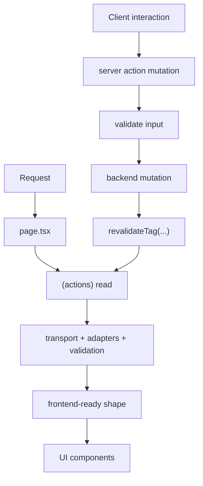
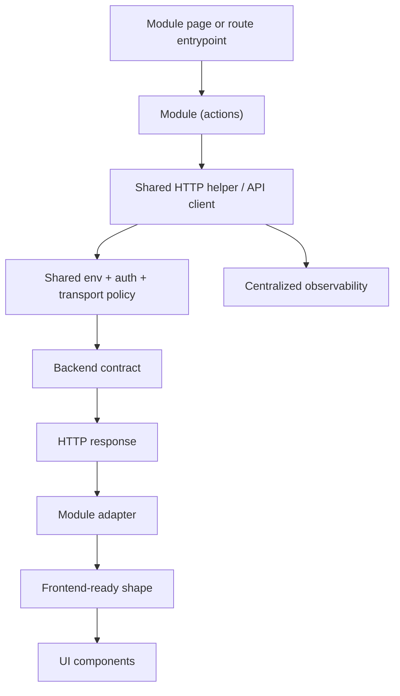

# Global Rules (Materialized)

## Source: `architecture/base-rules.md`

# Base Rules

## Base Rule

Every global rule in the repository must be brief, actionable, and written as a convention that teams or tools can verify.

## Objective

This baseline ensures the documentation remains consistent, composable, and useful as shared context across frontend projects.

## Source: `architecture/next16-modular.md`

# Next 16 Modular

## Scope

This document defines the baseline modular routing rule for frontend projects built on Next.js App Router.

## Rule 1: Authenticated Modules Must Live In The Protected App Tree

### Context

Next.js App Router projects become harder to reason about when authenticated modules are mixed with public routes without a visible structural boundary.

### Rule

Every authenticated functional module must live under the protected App Router tree of the project. In AXIS-aligned repositories, the canonical location is `src/app/[locale]/(protected)/[module]`. In non-AXIS repositories, an equivalent protected module boundary must still exist even if the exact folder shape differs.

### Example (Do/Don't)

- Do: place authenticated modules under a protected route group that makes access and ownership explicit.
- Don't: place protected business modules in the same undifferentiated route tree as public entry flows.

## Related Rules

- `architecture/axis-app-router-structure.md`
- `architecture/axis-feature-module-structure.md`

## Source: `architecture/actions-standard.md`

# Actions Standard

## Scope

This document defines the baseline rule for locating Server Actions inside frontend modules.

## Rule 1: Server Actions Must Live In The Module Action Boundary

### Context

Server Actions become hard to discover and govern when they are scattered across pages, components, and unrelated helper files.

### Rule

All Server Actions must live inside the action boundary of the module that consumes them. In AXIS-aligned repositories, the canonical structure is a dedicated `(actions)` folder with operation-specific files such as `get-books.action.ts` or `create-book.action.ts`. Repositories must not scatter Server Actions across pages or visual components.

### Example (Do/Don't)

- Do: colocate Server Actions inside the module-owned action boundary and keep one operation per action file when the module complexity requires it.
- Don't: define Server Actions inline in page components, UI components, or unrelated shared helpers.

## Related Rules

- `architecture/axis-feature-module-structure.md`
- `architecture/axis-server-data-flow.md`

## Source: `architecture/biome-rules.md`

# Biome Rules

## Scope

This document defines the mandatory global Biome baseline for all consuming frontend projects.

## Rule 1: Configuration Ownership

### Context

Biome is used as a shared formatter and static analysis gate across projects that consume GCF.

### Rule

Every consuming project must expose a Biome configuration aligned with this global baseline. Local repositories may extend the configuration for project-specific needs, but they must not weaken or disable the mandatory protections defined here.

### Example (Do/Don't)

- Do: start from the global baseline and add only project-local exceptions with clear justification.
- Don't: replace the baseline with ad hoc defaults, or silently disable core linting protections.

## Rule 2: File Coverage and Exclusions

### Context

Shared formatting and linting only remain reliable when all projects evaluate the same class of source files and exclude the same generated or non-authoritative paths.

### Rule

Biome must include the full repository by default and exclude generated, build, infrastructure, coverage, and test-only artifacts from the global baseline scan. At minimum, the baseline must exclude `dist`, `.infra`, `.next`, `coverage`, test files, mock files, setup test files, and generic config files.

### Example (Do/Don't)

- Do: lint application and library source files while excluding `**/dist/**`, `**/.next/**`, and `**/*.test.*`.
- Don't: scan generated output as first-class source, or force every project to lint setup and test harness files by default.

## Rule 3: Formatting Baseline

### Context

Cross-project diffs become noisy when each repository uses different formatting defaults for indentation, line endings, width, or JSX layout.

### Rule

The global Biome formatter baseline must be enabled and standardized with spaces, indentation width `2`, line ending `lf`, line width `100`, automatic expansion, visible bracket spacing, and formatting disabled on syntax errors. EditorConfig must not override this baseline.

### Example (Do/Don't)

- Do: keep `indentStyle: space`, `indentWidth: 2`, `lineWidth: 100`, and `useEditorconfig: false`.
- Don't: allow per-repository editor configuration to silently redefine the global formatter contract.

## Rule 4: Import Ordering Neutrality

### Context

Automatic import organization can create high-churn diffs and conflict with project-specific import grouping strategies.

### Rule

The global baseline must keep `assist.actions.source.organizeImports` disabled. If a repository needs import organization, it must define that policy explicitly outside the shared default and document the reason.

### Example (Do/Don't)

- Do: preserve existing import order unless the project defines an explicit import-ordering policy.
- Don't: auto-reorder imports globally without a documented cross-project convention.

## Rule 5: JavaScript and TypeScript Style

### Context

Projects need a stable formatting contract for JavaScript, TypeScript, and JSX so code review expectations remain consistent.

### Rule

The shared JavaScript formatter baseline must enforce single quotes for code, double quotes for JSX attributes, semicolons, trailing commas, parentheses on arrow function parameters, `quoteProperties: asNeeded`, and automatic JSX attribute positioning. Unsafe parameter decorators may remain enabled when required by the ecosystem.

### Example (Do/Don't)

- Do: format `const label = 'ready';` and `<Widget title="Ready" />`.
- Don't: mix quote strategies or omit semicolons based on local preference.

## Rule 6: HTML Formatting

### Context

HTML and template output should remain predictable across repositories that render markup directly.

### Rule

The shared HTML formatter baseline must self-close void elements consistently.

### Example (Do/Don't)

- Do: format void elements using the Biome self-closing convention.
- Don't: allow repositories to drift into mixed void-element styles without an explicit reason.

## Rule 7: Mandatory Correctness Rules

### Context

Certain classes of bugs must be blocked globally because they represent broken control flow, invalid language usage, or unreachable code rather than stylistic disagreement.

### Rule

The shared baseline must enable correctness rules as `error` for constant reassignment, constant conditions, empty patterns, invalid built-in instantiation, invalid `super()` usage, self-assignment, declarations inside switch clauses, undeclared variables, unreachable code, unreachable `super`, unsafe `finally`, unsafe optional chaining, invalid `for` direction, invalid `typeof` comparisons, and invalid generator yield behavior.

### Example (Do/Don't)

- Do: fail linting when a branch contains unreachable code or an undeclared variable.
- Don't: downgrade correctness failures to warnings in the shared baseline.

## Rule 8: Mandatory Suspicious Rules

### Context

Some patterns are strongly correlated with hidden defects, unsafe behavior, or maintenance risk and should be rejected before code review.

### Rule

The shared baseline must enable suspicious rules as `error` for async promise executors, assignment in `catch`, class reassignment, `debugger`, duplicate cases, duplicate class members, duplicate `else if` branches, duplicate object keys, duplicate parameters, empty blocks, switch fallthrough, function reassignment, global assignment, imported binding reassignment, redeclarations, sparse arrays, unsafe negation, `with`, and explicit `any`.

### Example (Do/Don't)

- Do: fail linting when `debugger`, duplicate object keys, or `any` appear in committed source.
- Don't: treat these patterns as optional cleanup items in the global baseline.

## Rule 9: Recommended Preset Control

### Context

The generic `recommended` preset can change over time and introduce silent global behavior changes across all consuming repositories.

### Rule

The global baseline must keep `linter.rules.recommended` disabled and declare each enforced rule explicitly in the shared configuration. New shared rules must be added intentionally through GCF governance updates.

### Example (Do/Don't)

- Do: add a new Biome rule explicitly in the GCF document and baseline when the organization approves it.
- Don't: inherit future rule changes implicitly by turning on `recommended`.

## Canonical Baseline Template

```json
{
  "$schema": "./node_modules/@biomejs/biome/configuration_schema.json",
  "assist": {
    "actions": {
      "source": {
        "organizeImports": "off"
      }
    }
  },
  "files": {
    "includes": [
      "**",
      "!**/dist/**",
      "!**/.infra/**",
      "!**/.next/**",
      "!**/coverage/**",
      "!**/*.test.*",
      "!**/*.mock.*",
      "!**/*.spec.*",
      "!**/setupTests.*",
      "!**/*.config.*"
    ]
  },
  "formatter": {
    "enabled": true,
    "formatWithErrors": false,
    "indentStyle": "space",
    "indentWidth": 2,
    "lineEnding": "lf",
    "lineWidth": 100,
    "attributePosition": "auto",
    "bracketSameLine": false,
    "bracketSpacing": true,
    "expand": "auto",
    "useEditorconfig": false
  },
  "linter": {
    "enabled": true,
    "rules": {
      "recommended": false,
      "correctness": {
        "noConstAssign": "error",
        "noConstantCondition": "error",
        "noEmptyPattern": "error",
        "noInvalidBuiltinInstantiation": "error",
        "noInvalidConstructorSuper": "error",
        "noSelfAssign": "error",
        "noSwitchDeclarations": "error",
        "noUndeclaredVariables": "error",
        "noUnreachable": "error",
        "noUnreachableSuper": "error",
        "noUnsafeFinally": "error",
        "noUnsafeOptionalChaining": "error",
        "useValidForDirection": "error",
        "useValidTypeof": "error",
        "useYield": "error"
      },
      "suspicious": {
        "noAsyncPromiseExecutor": "error",
        "noCatchAssign": "error",
        "noClassAssign": "error",
        "noDebugger": "error",
        "noDuplicateCase": "error",
        "noDuplicateClassMembers": "error",
        "noDuplicateElseIf": "error",
        "noDuplicateObjectKeys": "error",
        "noDuplicateParameters": "error",
        "noEmptyBlockStatements": "error",
        "noFallthroughSwitchClause": "error",
        "noFunctionAssign": "error",
        "noGlobalAssign": "error",
        "noImportAssign": "error",
        "noRedeclare": "error",
        "noSparseArray": "error",
        "noUnsafeNegation": "error",
        "noWith": "error",
        "noExplicitAny": "error"
      }
    }
  },
  "javascript": {
    "formatter": {
      "jsxQuoteStyle": "double",
      "quoteProperties": "asNeeded",
      "trailingCommas": "all",
      "semicolons": "always",
      "arrowParentheses": "always",
      "bracketSameLine": false,
      "quoteStyle": "single",
      "attributePosition": "auto",
      "bracketSpacing": true
    },
    "parser": {
      "unsafeParameterDecoratorsEnabled": true
    },
    "globals": ["exports"]
  },
  "html": {
    "formatter": {
      "selfCloseVoidElements": "always"
    }
  }
}
```

## Source: `architecture/typescript-rules.md`

# TypeScript Rules

## Scope

This document defines the mandatory global TypeScript baseline for frontend projects that consume GCF.

## Rule 1: Configuration Ownership

### Context

TypeScript is a primary correctness boundary for frontend projects, so drift in compiler behavior creates inconsistent guarantees between repositories.

### Rule

Every consuming project must expose a `tsconfig` aligned with this shared baseline. Local repositories may extend the baseline for framework or product-specific needs, but they must not weaken the mandatory correctness, resolution, and casing guarantees.

### Example (Do/Don't)

- Do: inherit the global defaults and add only documented local extensions.
- Don't: silently disable strictness or module resolution constraints for convenience.

## Rule 2: Runtime and Language Target

### Context

Projects need a common compilation target so language features, polyfill expectations, and framework integrations remain predictable.

### Rule

The shared baseline must compile against `target: ES2022`, use `module: ESNext`, and expose `lib: ["ES2023", "DOM", "DOM.Iterable"]` for browser-oriented frontend applications.

### Example (Do/Don't)

- Do: use modern ECMAScript targets compatible with current frontend toolchains.
- Don't: downlevel the shared baseline to legacy runtime assumptions without an explicit cross-project requirement.

## Rule 3: Bundler-Oriented Module Resolution

### Context

Modern frontend projects rely on bundler-native resolution semantics, JSON imports, and ESM-first behavior.

### Rule

The shared baseline must use `moduleResolution: Bundler`, `resolveJsonModule: true`, `esModuleInterop: true`, and `allowSyntheticDefaultImports: true` to align TypeScript resolution with modern bundler behavior.

### Example (Do/Don't)

- Do: configure TypeScript to match the import behavior expected by modern frontend build systems.
- Don't: mix Node legacy resolution assumptions into the shared frontend baseline by default.

## Rule 4: No-Emit Type Checking

### Context

This repository governs application quality, not TypeScript artifact generation. In modern frontend stacks, emission is typically handled by framework or build tooling.

### Rule

The shared baseline must keep `noEmit: true` so TypeScript is used as a type checker rather than a direct build emitter in consuming repositories.

### Example (Do/Don't)

- Do: run TypeScript for validation while leaving output generation to the framework toolchain.
- Don't: rely on `tsc` emit as the default cross-project build contract.

## Rule 5: Strictness Baseline

### Context

Shared quality expectations require TypeScript to reject ambiguous or weakly typed code paths consistently across projects.

### Rule

The shared baseline must enable `strict: true`, `isolatedModules: true`, `forceConsistentCasingInFileNames: true`, and `noFallthroughCasesInSwitch: true`. These options are mandatory because they prevent silent type weakening, cross-platform path casing drift, and unsafe control flow.

### Example (Do/Don't)

- Do: fail validation when a switch falls through unintentionally or a path casing mismatch only works on one operating system.
- Don't: weaken strict mode or allow inconsistent casing as a local shortcut.

## Rule 6: Incremental and Framework-Aware Operation

### Context

Frontend repositories often use framework plugins and incremental analysis to keep feedback fast without changing correctness semantics.

### Rule

The shared baseline may enable `incremental: true` and must permit framework plugins such as `next` when the consuming stack requires them. Framework plugins are allowed only as tooling integration and must not override the baseline correctness rules.

### Example (Do/Don't)

- Do: use the `next` TypeScript plugin in a Next.js repository while preserving the shared baseline.
- Don't: treat framework plugin behavior as a substitute for the global TypeScript contract.

## Rule 7: JavaScript Interoperability Policy

### Context

Some frontend repositories still contain transitional JavaScript files that need to coexist with TypeScript during migration periods.

### Rule

The shared baseline may allow `allowJs: true` to support progressive migration, but TypeScript-first code remains the target state. Repositories that keep JavaScript enabled must treat it as a compatibility bridge, not as permission to avoid typed module design.

### Example (Do/Don't)

- Do: keep `allowJs: true` while migrating legacy modules into typed source.
- Don't: use the shared baseline to justify indefinite JavaScript-first development in new modules.

## Rule 8: Mandatory Type Check Command

### Context

Global TypeScript governance is only enforceable when every frontend repository exposes a deterministic command that validates the shared type baseline.

### Rule

Every consuming frontend project must define a `type:check` script in `package.json` with the command `tsc --noEmit`. This command is mandatory even when the repository also uses framework-specific validation commands.

### Example (Do/Don't)

- Do: expose `"type:check": "tsc --noEmit"` as the canonical type validation entrypoint.
- Don't: rely only on editor feedback or framework build commands without a dedicated repository-level type check command.

## Rule 9: No `any` In Included Source

### Context

The value of a strict TypeScript baseline collapses when included source files are allowed to bypass the type system through unrestricted `any` usage.

### Rule

`any` types are forbidden in files included by the shared TypeScript baseline. Consuming projects must model unknown or variable data with safer alternatives such as explicit interfaces, unions, generics, or `unknown` with narrowing. This prohibition applies to function parameters, return values, variables, object fields, and intermediate casts in included source.

### Example (Do/Don't)

- Do: replace `any` with `unknown`, domain types, generic constraints, or validated parser outputs.
- Don't: annotate included application source with `any` to bypass typing gaps or speed up implementation.

## Rule 10: Library Check Relaxation

### Context

Third-party type packages can produce high-noise validation failures that do not reflect the quality of the consuming application code.

### Rule

The shared baseline may keep `skipLibCheck: true` and `skipDefaultLibCheck: true` to reduce external type noise, but those settings only relax library validation. They must not be interpreted as a relaxation of application strictness.

### Example (Do/Don't)

- Do: skip third-party declaration checking while keeping local application code under strict validation.
- Don't: use library-skip options as a reason to lower source-level type discipline.

## Rule 11: JSX and Frontend Compatibility

### Context

React-based frontend projects require a stable JSX transform mode so framework expectations remain consistent.

### Rule

The shared baseline must use `jsx: react-jsx` for React-oriented repositories unless a consuming framework explicitly requires a different JSX runtime.

### Example (Do/Don't)

- Do: keep the React automatic JSX runtime as the default frontend baseline.
- Don't: switch JSX modes per repository without a concrete framework requirement.

## Rule 12: Path Alias Governance

### Context

Frontend codebases benefit from stable aliases for application source and root-level utilities, but inconsistent aliasing creates ambiguous imports between projects.

### Rule

The shared baseline may define root aliases through `compilerOptions.paths`. At minimum, the baseline supports a source alias such as `@/* -> ./src/*` and may support a controlled root alias when the repository has a documented need for it. Alias policy must remain minimal, predictable, and framework-compatible.

### Example (Do/Don't)

- Do: expose `@/*` for source imports when the repository uses `src/` as the application root.
- Don't: create many overlapping aliases that hide ownership boundaries or make import intent unclear.

## Rule 13: Ambient Types Policy

### Context

Global type packages influence editor behavior, test environments, and runtime assumptions across the whole repository.

### Rule

The shared baseline may declare explicit ambient types such as `jest`, `node`, and `@testing-library/jest-dom` when those environments are part of the standard frontend toolchain. Repositories must declare ambient types intentionally and avoid broad, implicit global typing.

### Example (Do/Don't)

- Do: register test and runtime globals explicitly when they are part of the project contract.
- Don't: rely on undeclared ambient globals or add unnecessary type packages globally.

## Rule 14: Source Inclusion Policy

### Context

Type checking becomes unreliable when repositories vary widely in what they consider authoritative source.

### Rule

The shared baseline must include runtime source, framework environment declarations, and required generated type stubs. At minimum, the baseline may include entries such as `src`, `scripts`, framework env files, middleware files, and framework-generated type folders when they are part of the build contract.

### Example (Do/Don't)

- Do: include `src`, `scripts`, `next-env.d.ts`, and framework type stubs required for correct checking.
- Don't: type-check only a partial subset of the repository while leaving key source entrypoints outside the baseline.

## Rule 15: Source Exclusion Policy

### Context

Generated artifacts, test harnesses, stories, compositions, and infrastructure folders should not distort the shared application type-checking baseline.

### Rule

The shared baseline must exclude generated output, infrastructure directories, test files, test folders, story files, composition files, config files, coverage output, and `node_modules`. At minimum, this baseline excludes `dist`, `mock`, `.infra`, `.next`, `coverage`, `*.test.*`, `*.tests.*`, `*.spec.*`, `*.stories.*`, `*.composition.*`, `setupTests.*`, `*.config.*`, `__tests__`, `__test__`, `tests`, and `node_modules`.

### Example (Do/Don't)

- Do: keep the baseline focused on production-oriented source and required build-time declarations.
- Don't: turn test harnesses and generated artifacts into default global TypeScript scope.

## Canonical Baseline Template

```json
{
  "compilerOptions": {
    "target": "ES2022",
    "lib": ["ES2023", "DOM", "DOM.Iterable"],
    "module": "ESNext",
    "skipLibCheck": true,
    "moduleResolution": "Bundler",
    "resolveJsonModule": true,
    "noEmit": true,
    "jsx": "react-jsx",
    "esModuleInterop": true,
    "strict": true,
    "paths": {
      "@/*": ["./src/*"],
      ".*": ["./*"]
    },
    "types": ["jest", "node", "@testing-library/jest-dom"],
    "allowJs": true,
    "incremental": true,
    "isolatedModules": true,
    "plugins": [
      {
        "name": "next"
      }
    ],
    "skipDefaultLibCheck": true,
    "allowSyntheticDefaultImports": true,
    "forceConsistentCasingInFileNames": true,
    "noFallthroughCasesInSwitch": true
  },
  "include": [
    "next-env.d.ts",
    "images.d.ts",
    "scripts",
    "src",
    ".next/types/**/*.ts",
    "src/middleware.ts",
    ".next/dev/types/**/*.ts"
  ],
  "exclude": [
    "**/dist/**",
    "**/mock/**",
    "**/.infra/**",
    "**/.next/**",
    "**/coverage/**",
    "**/*.test.*",
    "**/*.tests.*",
    "**/*.spec.*",
    "**/*.stories.*",
    "**/*.composition.*",
    "**/setupTests.*",
    "**/*.config.*",
    "**/node_modules/**",
    "**/__tests__/**",
    "**/__test__/**",
    "**/tests/**"
  ]
}
```

## Source: `architecture/axis-app-router-structure.md`

# AXIS App Router Structure

## Scope

This document defines the mandatory AXIS baseline for structuring frontend applications on top of Next.js App Router.

## Rule 1: Locale-Centric App Root

### Context

AXIS Frontend organizes the application around locale-aware routing so internationalization, layouts, and feature ownership remain aligned from the root of the App Router tree.

### Rule

Every AXIS frontend application must structure its functional routing under `src/app/[locale]`. The `[locale]` segment is the canonical application root for route-level composition, localized layouts, and feature entrypoints.

### Example (Do/Don't)

- Do: place feature routes, locale layout, and providers under `src/app/[locale]`.
- Don't: split the main application tree between localized and non-localized route roots without an explicit framework-level exception.

## Rule 2: Public and Protected Route Separation

### Context

AXIS applications need a clear boundary between routes that are publicly reachable and routes that belong to authenticated work areas.

### Rule

Inside `src/app/[locale]`, applications must separate user-facing public flows from protected work areas through dedicated route groups. The canonical AXIS baseline uses `(public)` for public routes and `(protected)` for authenticated routes.

### Example (Do/Don't)

- Do: place login and publicly accessible entry screens under `(public)`, and business modules under `(protected)`.
- Don't: mix protected feature routes with public navigation flows in the same unbounded tree.

## Rule 3: Layout Ownership By Layer

### Context

App Router becomes hard to reason about when layout concerns are distributed arbitrarily across pages and features.

### Rule

AXIS applications must preserve explicit layout ownership by layer:

- `src/app/layout.tsx` owns the application root shell.
- `src/app/[locale]/layout.tsx` owns locale-aware composition.
- Route-group layouts such as `(public)/layout.tsx` or `(protected)/layout.tsx` own section-specific wrappers.

Pages and feature folders must not absorb layout responsibilities that belong to a higher structural layer.

### Example (Do/Don't)

- Do: keep locale providers and locale validation at the `[locale]` layer, and area shells at the route-group layer.
- Don't: duplicate top-level layout concerns inside feature pages just because a module needs them.

## Rule 4: Providers Belong To The Locale Tree

### Context

Global providers in AXIS usually depend on locale, translations, session context, or route-level application state.

### Rule

Shared providers that scope the running application experience must be mounted from the locale tree, typically through `src/app/[locale]/providers.tsx` and the locale layout. Provider wiring must not be scattered across feature-level pages.

### Example (Do/Don't)

- Do: mount i18n and other cross-cutting providers from `src/app/[locale]/providers.tsx`.
- Don't: re-register application-wide providers inside individual module pages or feature components.

## Rule 5: Feature Modules Live Under Route Groups

### Context

AXIS treats modules as functional units of ownership. Their location in the App Router tree should reveal whether they belong to the public experience or to the protected work area.

### Rule

Feature modules must live inside the route group that matches their access boundary. Protected business modules belong under `src/app/[locale]/(protected)/[module]`. Public modules belong under `src/app/[locale]/(public)/[module]` when they represent navigable public functionality.

### Example (Do/Don't)

- Do: place a business module such as `books` under `src/app/[locale]/(protected)/books`.
- Don't: place protected modules as siblings of `(public)` and `(protected)` without preserving the access boundary in the tree.

## Rule 6: Route Groups Are Structural Boundaries, Not Cosmetic Folders

### Context

In AXIS, route groups are used to express architectural boundaries, not only to keep the tree visually tidy.

### Rule

Route groups such as `(public)` and `(protected)` must represent real differences in ownership, access model, or area-level composition. They must not be created as generic buckets without a structural purpose.

### Example (Do/Don't)

- Do: create a route group when it clarifies access, layout ownership, or cross-cutting behavior for a section.
- Don't: create route groups as arbitrary organizational wrappers that do not express any architectural boundary.

## Rule 7: Proxy Composition At The Edge

### Context

AXIS applications often combine locale routing, session checks, and route protection before the request enters the application tree.

### Rule

When the application requires edge-level composition, the canonical AXIS entrypoint is `src/proxy.ts`. Edge checks such as route protection, locale handling, or session-aware gatekeeping must be centralized there instead of being duplicated inconsistently across unrelated pages.

### Example (Do/Don't)

- Do: compose i18n and protected-route checks from `src/proxy.ts`.
- Don't: rely on scattered page-level guards as the only boundary for protected sections when edge composition is already part of the application architecture.

## Rule 8: Locale Types And Shared App Types Stay Near The App Root

### Context

AXIS reference structures reserve space near the locale tree for route-level types and composition helpers that support the application shell.

### Rule

Application-level types or helpers tightly coupled to the locale App Router tree may live alongside the route structure, for example in folders such as `src/app/[locale]/(types)`. They must remain scoped to app-level composition and must not duplicate feature-domain models.

### Example (Do/Don't)

- Do: keep app-routing or locale-composition types close to the locale tree when they support the route shell.
- Don't: move feature-domain schemas into app-level type folders just because they are used by a page.

## Rule 9: Structure Must Reflect Access And Composition First

### Context

AXIS does not require every project to clone the exact same folder tree, but it does require the architecture to preserve the same mental model.

### Rule

The App Router tree must be organized first by access boundary and composition layer, and only then by page implementation detail. Projects may adapt naming or depth where needed, but they must preserve the structural cuts between locale root, public/protected areas, providers, and feature modules.

### Example (Do/Don't)

- Do: adapt a project to its real scale while preserving the boundary between locale root, area-level groups, and modules.
- Don't: flatten the tree so much that access model, ownership, and composition become implicit or ambiguous.

## Canonical Reference Shape

```text
src/
|-- app/
|   |-- [locale]/
|   |   |-- (components)/
|   |   |-- (public)/
|   |   |   |-- layout.tsx
|   |   |   |-- page.tsx
|   |   |   `-- login/
|   |   |-- (protected)/
|   |   |   |-- layout.tsx
|   |   |   `-- books/
|   |   |-- (types)/
|   |   |-- layout.tsx
|   |   `-- providers.tsx
|   |-- globals.css
|   `-- layout.tsx
`-- proxy.ts
```

## Source: `architecture/axis-feature-module-structure.md`

# AXIS Feature Module Structure

## Scope

This document defines the mandatory AXIS baseline for structuring feature modules inside the frontend application tree.

## Rule 1: Feature Modules Are The Primary Unit Of Functional Ownership

### Context

AXIS Frontend treats each feature module as the main boundary for business ownership, UI composition, data integration, and domain modeling.

### Rule

Every non-trivial frontend capability must be organized as a feature module with explicit internal boundaries. A feature module must group together the files that implement its routes, UI, data integration, and domain logic instead of scattering them across unrelated folders.

### Example (Do/Don't)

- Do: keep all files for a module such as `books` under a single module root.
- Don't: spread pages, actions, models, and adapters for the same module across unrelated top-level folders.

## Rule 2: Module Placement Follows The App Router Boundary

### Context

The access model and route ownership of a feature should remain visible from its path in the App Router tree.

### Rule

A feature module must live under the route group that matches its access boundary, for example `src/app/[locale]/(protected)/[module]` for protected business modules or `src/app/[locale]/(public)/[module]` for public navigable modules.

### Example (Do/Don't)

- Do: place `books` under `src/app/[locale]/(protected)/books`.
- Don't: place a protected business feature outside the protected route tree.

## Rule 3: Modules Must Separate Internal Responsibilities

### Context

A feature becomes hard to maintain when routing, UI, integration, and domain concerns are mixed in the same files or folders.

### Rule

AXIS feature modules must preserve an explicit internal split between:

- pages and route entrypoints
- backend IO and mutations
- payload adaptation
- domain schemas and types
- UI components

This split may be implemented with dedicated folders such as `(pages)`, `(actions)`, `(adapters)`, `(models)`, and `(components)`.

### Example (Do/Don't)

- Do: keep module IO in `(actions)`, adapters in `(adapters)`, and UI in `(components)`.
- Don't: let page components perform raw contract translation or own business validation directly.

## Rule 4: `(actions)` Is The Canonical IO Boundary

### Context

AXIS modules centralize reads and mutations in a dedicated layer so pages and components do not become integration surfaces.

### Rule

All backend reads and writes for a module must be defined inside `(actions)` or the canonical module action boundary. That folder owns HTTP integration, cache invalidation coordination, and mutation orchestration for the module.

### Example (Do/Don't)

- Do: place `get-books.action.ts`, `create-book.action.ts`, and `update-book.action.ts` inside `(actions)`.
- Don't: call protected backend endpoints directly from page files or visual components.

## Rule 5: `(adapters)` Own External-To-Internal Translation

### Context

Backend payloads, especially transport-specific contracts, should not leak into UI or domain usage without an explicit translation boundary.

### Rule

When a module consumes an external contract that differs from the shape expected by the frontend, the translation must live in `(adapters)`. UI and pages must consume the adapted module shape, not the raw transport payload.

### Example (Do/Don't)

- Do: deserialize and normalize JSON:API responses inside `(adapters)`.
- Don't: map backend payload fields ad hoc inside tables, forms, or page entrypoints.

## Rule 6: `(models)` Is The Canonical Domain Schema Boundary

### Context

AXIS modules need a single source of truth for domain validation, form validation, and derived TypeScript types.

### Rule

The `(models)` folder must define the module domain schemas and derived types, typically with `zod`. Feature-domain entities, form schemas, and mutation input schemas must live there unless they are truly application-wide and no longer belong to the module.

### Example (Do/Don't)

- Do: define `BookSchema`, `CreateBookFormSchema`, and `UpdateBookFormSchema` in `(models)`.
- Don't: duplicate the same entity shape manually across UI files, action files, and app-level type folders.

## Rule 7: `(components)` Is Reserved For Module UI

### Context

Module-specific components need a clear home so UI composition remains local to the feature that owns it.

### Rule

The `(components)` folder must contain UI pieces owned by the module, such as tables, toolbars, forms, section views, or local display helpers. Components that belong only to the module must stay there until they have stable reuse outside the module boundary.

### Example (Do/Don't)

- Do: keep `BooksTable` and `BooksToolbar` inside the `books` module.
- Don't: move feature-specific UI into shared folders before a second real consumer exists.

## Rule 8: `(pages)` Becomes Mandatory When A Module Has Multiple Routes

### Context

Multi-page modules need a visible distinction between route entrypoints and the rest of the module internals.

### Rule

If a module exposes more than one navigable page, those routes must be grouped under `(pages)`. If the module exposes only a single page, `(pages)` may be omitted and the root `page.tsx` may remain at module level.

### Example (Do/Don't)

- Do: group `create/page.tsx` and `[id]/page.tsx` under `(pages)` when the module has multiple routes.
- Don't: spread several nested page entrypoints across the module root without an explicit route grouping boundary.

## Rule 9: Module Root Files Own Module-Level UX Boundaries

### Context

Certain App Router files express module-level behavior rather than behavior of a specific inner route.

### Rule

Module root files such as `page.tsx`, `loading.tsx`, and `error.tsx` must be reserved for module-level routing and UX boundaries. They should not be used as generic dumping grounds for unrelated implementation details.

### Example (Do/Don't)

- Do: use `loading.tsx` for module-level loading behavior and `error.tsx` for the module error boundary.
- Don't: place unrelated helpers or side concerns at module root just because they are easy to find there.

## Rule 10: Modules Must Keep Cross-Cutting Infrastructure Outside The Feature Unless Owned Locally

### Context

Features depend on shared infrastructure such as auth, translation, cache, and HTTP primitives, but those concerns do not always belong inside each module.

### Rule

A feature module must contain only the parts it truly owns. Cross-cutting infrastructure such as application-wide auth, translation, shared HTTP primitives, or environment services must remain outside the feature unless the module owns a local specialization of that concern.

### Example (Do/Don't)

- Do: keep module-specific actions and adapters inside the feature while using shared HTTP primitives from a common layer.
- Don't: clone auth, translation, or generic infrastructure inside every module.

## Rule 11: Structure Must Scale Without Copying The Reference Blindly

### Context

The AXIS reference module shows a mature feature structure, but not every project starts at that level of complexity.

### Rule

Projects may start with a smaller module shape, but they must preserve the same architectural cuts as the feature grows. Teams must evolve into the canonical folders when the module complexity requires them, instead of collapsing responsibilities permanently into fewer files.

### Example (Do/Don't)

- Do: start with a minimal feature and introduce `(pages)`, `(adapters)`, or `(components)` when the feature complexity becomes real.
- Don't: use early-stage simplicity as a reason to permanently mix routing, IO, validation, and UI in the same file set.

## Canonical Reference Shape

```text
src/app/[locale]/(protected)/books/
|-- (actions)/
|   |-- create-book.action.ts
|   |-- delete-book.action.ts
|   |-- get-book.action.ts
|   |-- get-books-per-year.action.ts
|   |-- get-books.action.ts
|   |-- restore-book.action.ts
|   `-- update-book.action.ts
|-- (adapters)/
|   `-- book.adapter.ts
|-- (components)/
|-- (models)/
|   `-- book.schema.ts
|-- (pages)/
|   |-- create/
|   |   `-- page.tsx
|   `-- [id]/
|       `-- page.tsx
|-- error.tsx
|-- page.tsx
`-- loading.tsx
```

## Source: `architecture/axis-common-layer-scope.md`

# AXIS Common Layer Scope

## Scope

This document defines the mandatory AXIS baseline for deciding when code belongs in `common`, when it belongs in a route-group common layer, and when it must remain inside a feature module.

## Rule 1: `common` Requires Real Shared Ownership

### Context

Shared folders lose architectural value when they become default destinations for code that has not yet proven stable reuse.

### Rule

The `common` layer may only contain pieces that are shared by more than one real consumer and whose scope is clearly identifiable. If a piece still belongs to a single feature, it must remain inside that feature.

### Example (Do/Don't)

- Do: move a utility to `common` only after at least two real consumers require the same behavior.
- Don't: promote feature-local code to `common` just because it looks reusable in theory.

## Rule 2: Choose The Narrowest Valid Scope

### Context

AXIS favors ownership boundaries that stay as close as possible to the actual place of use.

### Rule

When extracting shared code, teams must choose the narrowest scope that still matches the real reuse boundary:

- `src/common` for application-wide shared capabilities
- `src/app/[locale]/(group)/common` for route-group shared capabilities
- feature-local folders for feature-owned pieces

The broadest shared scope must not be used by default.

### Example (Do/Don't)

- Do: place a protected-area table helper in `src/app/[locale]/(protected)/common` if only protected modules use it.
- Don't: place the same helper in `src/common` unless the whole application truly depends on it.

## Rule 3: `src/common` Is Reserved For Application-Wide Infrastructure

### Context

The top-level `common` layer is the most expensive shared scope because everything there becomes a candidate dependency for the whole application.

### Rule

`src/common` must be reserved for cross-cutting infrastructure, services, utilities, or contracts that are stable and global to the application. Typical examples include environment services, translation infrastructure, shared HTTP primitives, or global utility helpers with established reuse.

### Example (Do/Don't)

- Do: place translation routing or environment services in `src/common`.
- Don't: put a module-specific filter mapper in `src/common` just because it might be copied later.

## Rule 4: Route-Group `common` Is Valid Only For Stable Section Reuse

### Context

Some shared pieces are not global to the application, but they are also no longer owned by a single feature.

### Rule

A route-group-scoped common layer such as `src/app/[locale]/(public)/common` or `src/app/[locale]/(protected)/common` may be introduced only when several modules inside that route group share a stable need that does not belong at application-wide scope.

### Example (Do/Don't)

- Do: create `(protected)/common` for shell components or utilities shared by several protected modules.
- Don't: introduce a route-group `common` preemptively before multiple real consumers exist.

## Rule 5: Feature Code Stays In The Feature Until Reuse Is Proven

### Context

Premature extraction hides ownership and makes small features look more abstract than they really are.

### Rule

A piece that is only used by one feature must stay inside that feature, even if it seems reusable. Reuse must be demonstrated by real module consumption before extraction to any shared common layer.

### Example (Do/Don't)

- Do: keep `books`-only helpers, models, or components inside the `books` module.
- Don't: create a shared folder for a single-feature abstraction that has no second consumer.

## Rule 6: `common` Must Preserve Clear Ownership

### Context

Shared folders become dumping grounds when ownership is not explicit and scope decisions are not reviewed.

### Rule

Every piece moved to `common` must still have a clear responsibility and a recognizable ownership boundary. `common` must not be used as a fallback location for code that no one knows where to place.

### Example (Do/Don't)

- Do: move a capability to `common` with a clear explanation of who consumes it and why its scope is shared.
- Don't: place mixed helpers, partial components, and unrelated types together under `common` without a clear boundary.

## Rule 7: Extraction Must Follow Evolution, Not Forecasting

### Context

AXIS applications often start small and grow into more explicit layers over time. Over-forecasting reuse produces noise and rigid abstractions.

### Rule

Teams must evolve into broader common layers only when the application complexity justifies them. A new application is not required to start with a large `src/common`; instead, common layers should be extracted as the architecture actually matures.

### Example (Do/Don't)

- Do: start with feature-local code and extract `src/common/http` only when several modules share the same client behavior.
- Don't: bootstrap a large common hierarchy on day one without concrete consumers.

## Rule 8: Cross-Cutting Infrastructure Is Extracted By Concern

### Context

Some concerns naturally become shared earlier than others because they cross feature boundaries by design.

### Rule

When shared concerns emerge, they must be extracted according to their real architectural role. Typical AXIS extraction paths include:

- `src/common/http` for shared HTTP primitives
- `src/common/translation` for i18n infrastructure
- `src/common/auth` for shared auth/session capabilities
- `src/common/services` for environment or runtime services

Teams must not force unrelated concerns into the same shared folder just because they are all "common."

### Example (Do/Don't)

- Do: create a focused shared folder such as `src/common/translation` when the app needs transversal i18n wiring.
- Don't: mix HTTP, auth, translation, and feature UI in one generic shared bucket.

## Rule 9: `common` Must Be Reviewed For Drift

### Context

Even well-structured common layers can drift over time as more pieces accumulate without periodic scope checks.

### Rule

Projects must periodically review shared common layers to confirm that each piece still belongs at its current scope. If a shared layer starts mixing unrelated responsibilities or storing feature-owned code, those pieces must be moved down to the closest valid boundary.

### Example (Do/Don't)

- Do: refactor a growing `common` folder when it starts to mix unrelated concerns or dead abstractions.
- Don't: assume that code in `common` is automatically correct forever once extracted.

## Rule 10: Shared Scope Must Improve Clarity, Not Hide Structure

### Context

The goal of a common layer is to reduce duplication while preserving a legible architecture.

### Rule

A shared layer is only valid if it makes the architecture clearer and more maintainable. If moving code to `common` obscures where responsibility lives, the extraction is architecturally incorrect even if it removes duplication.

### Example (Do/Don't)

- Do: extract shared code when it reduces duplication and makes ownership easier to understand.
- Don't: treat deduplication alone as sufficient reason to move code out of a feature.

## Canonical Scope Model

```text
src/
|-- common/                            # application-wide shared infrastructure
|   |-- auth/
|   |-- http/
|   |-- services/
|   `-- translation/
`-- app/
    `-- [locale]/
        |-- (public)/
        |   `-- common/               # only if several public modules share stable needs
        `-- (protected)/
            |-- common/               # only if several protected modules share stable needs
            `-- books/                # feature-owned code stays local until reuse is proven
```

## Source: `architecture/axis-server-data-flow.md`

# AXIS Server Data Flow

## Scope

This document defines the mandatory AXIS baseline for reading, mutating, and revalidating backend data in frontend modules.

## Rule 1: Backend Data Must Be Read On The Server

### Context

AXIS Frontend is built on a server-first model where route orchestration and backend integration are expected to happen in the server tree.

### Rule

All protected backend reads must execute on the server. Pages and module flows must obtain their primary data through server-side execution paths instead of client-side fetching for initial or authoritative reads.

### Example (Do/Don't)

- Do: resolve module data from `page.tsx` through server-side actions.
- Don't: use `useEffect` in a Client Component as the default way to load protected module data.

## Rule 2: Module Reads And Mutations Must Go Through `(actions)`

### Context

AXIS uses module action boundaries to keep integration concerns out of visual components and route orchestration files.

### Rule

Every module read and mutation must be implemented inside the module `(actions)` boundary. Pages may orchestrate those actions, but they must not become the integration layer themselves.

### Example (Do/Don't)

- Do: place `get-books.action.ts`, `create-book.action.ts`, and `delete-book.action.ts` in `(actions)`.
- Don't: call the backend directly from a table component, form component, or page file.

## Rule 3: `page.tsx` Orchestrates, It Does Not Own Integration Details

### Context

Server pages need to coordinate params, translations, search state, and rendering, but they should not absorb transport or cache logic.

### Rule

The module `page.tsx` may orchestrate server reads, search params, locale resolution, and component composition, but backend request construction, transport details, and mutation logic must remain in `(actions)` and supporting layers.

### Example (Do/Don't)

- Do: read `params` and `searchParams` in `page.tsx`, then call a module action and pass the result to UI components.
- Don't: build raw HTTP requests, adapt payloads, and manage revalidation directly inside `page.tsx`.

## Rule 4: Mutations Must Stay In Server Actions

### Context

Mutations affect data integrity, authorization, and cache consistency, so they must stay inside a controlled server boundary.

### Rule

Create, update, delete, restore, and other state-changing operations must be implemented as server-side module actions. Client-side components may trigger them, but the mutation itself must remain on the server.

### Example (Do/Don't)

- Do: execute create and update flows through server actions triggered by forms or UI events.
- Don't: move protected business mutations into client-only state handlers or browser fetch calls.

## Rule 5: Validation Must Happen Before Outbound Mutation Requests

### Context

Server-side mutation boundaries are only safe if they validate their domain inputs before sending data to the backend.

### Rule

Module mutations must validate incoming data before performing the outbound request. Domain or form schemas must be applied inside the mutation flow so invalid inputs fail before they reach the transport layer.

### Example (Do/Don't)

- Do: run `safeParse(...)` in the action before calling the backend.
- Don't: trust raw form payloads and defer all validation responsibility to the backend.

## Rule 6: Cache Tags Must Be Explicit And Stable

### Context

Cache invalidation only works predictably when reads and mutations share a stable tagging strategy.

### Rule

Server reads must declare explicit cache tags that reflect the module data they represent. Tags must be stable, predictable, and named according to the module or data slice they identify.

### Example (Do/Don't)

- Do: tag a books listing read with a stable tag such as `books`.
- Don't: omit tags on cacheable reads or invent inconsistent names for the same data slice.

## Rule 7: Successful Mutations Must Revalidate Their Affected Tags

### Context

AXIS modules rely on explicit invalidation so the UI reflects the true post-mutation state of the backend.

### Rule

After a successful mutation, the module must explicitly revalidate every affected cache tag. Revalidation must happen inside the mutation flow, close to the successful server-side state change.

### Example (Do/Don't)

- Do: call `revalidateTag("books", "max")` after a successful create, update, delete, or restore action.
- Don't: assume the UI will refresh correctly without explicit invalidation after mutating module state.

## Rule 8: Cache Infrastructure Does Not Replace Functional Invalidation

### Context

Persistent cache infrastructure can improve runtime behavior, but it does not remove the need for feature-level invalidation rules.

### Rule

Additional cache infrastructure such as persistent cache handlers may be used, but they must never replace explicit module-level tagging and revalidation. Functional invalidation remains mandatory even when runtime cache persistence exists.

### Example (Do/Don't)

- Do: use persistent cache infrastructure as an implementation detail while still tagging reads and calling `revalidateTag(...)`.
- Don't: assume that a cache handler makes mutation-driven invalidation unnecessary.

## Rule 9: Visual Components Must Not Own Data Integration Or Cache Decisions

### Context

When visual components own transport or cache logic, feature behavior becomes harder to test, reason about, and reuse.

### Rule

Visual components must consume already-orchestrated data and trigger module actions through explicit interfaces. They must not decide what endpoint to call, how to authenticate, how to adapt payloads, or what cache tag to invalidate.

### Example (Do/Don't)

- Do: pass adapted data and action handlers into a table or form component.
- Don't: hide endpoint URLs, headers, or revalidation rules inside a feature component.

## Rule 10: Suspense Is A Rendering Tool, Not A Replacement For Server Data Boundaries

### Context

AXIS uses `Suspense` to improve rendering flows, but it does not change the ownership of data access or mutation logic.

### Rule

`Suspense` may be used around asynchronous parts of the module UI when it improves the experience, but reads must still originate from the server data flow and not be displaced into client fetching patterns just to enable loading states.

### Example (Do/Don't)

- Do: wrap a server-driven table or analytics section in `Suspense` when it benefits from async rendering boundaries.
- Don't: move protected reads into client-side effects solely to recreate a loading state already supported by the server flow.

## Rule 11: Server Data Flow Must Return Frontend-Usable Shapes

### Context

Pages and components should render against stable frontend shapes, not raw transport contracts.

### Rule

Module actions must return data that is already usable by the frontend rendering layer. If external contract transformation is required, it must happen before data reaches the page or visual component boundary.

### Example (Do/Don't)

- Do: return adapted module data from a read action before the page renders it.
- Don't: return raw transport payloads and let each component interpret them independently.

## Rule 12: Data Flow Must Preserve A Clear Ownership Chain

### Context

A maintainable AXIS feature has a visible path from request entry to rendered UI and back through mutation flows.

### Rule

The canonical ownership chain for a module data flow is:

- request enters the App Router tree
- `page.tsx` or a route entrypoint orchestrates the module
- `(actions)` performs reads or mutations
- supporting layers adapt and validate data
- UI components render the resulting frontend shape

Projects may refine the internal implementation, but they must preserve this ownership chain.

### Example (Do/Don't)

- Do: keep a visible path from request to page orchestration to actions to adapted data to UI.
- Don't: blur the flow by scattering reads, mutations, validation, and rendering decisions across unrelated client files.

## Canonical Flow Model



## Source: `architecture/axis-http-integration.md`

# AXIS HTTP Integration

## Scope

This document defines the mandatory AXIS baseline for integrating frontend modules with backend services through a shared HTTP layer.

## Rule 1: Backend Integration Must Use A Shared HTTP Layer

### Context

AXIS applications depend on consistent transport behavior across modules, including base URL resolution, headers, timeout policy, retries, and response interpretation.

### Rule

All backend integration must go through a shared HTTP layer instead of ad hoc per-module fetch logic. That shared layer owns the canonical transport behavior for the application and must be reused by module actions.

### Example (Do/Don't)

- Do: call the backend through shared HTTP primitives consumed by module actions.
- Don't: let each module define its own raw fetch strategy, retry behavior, or request defaults.

## Rule 2: Module Actions Consume Shared HTTP Primitives

### Context

Modules need local ownership of business operations, but they should not reimplement transport mechanics every time they talk to the backend.

### Rule

Module `(actions)` must consume shared HTTP primitives from the common layer. Actions own the business operation, while the common HTTP layer owns transport mechanics, request policy, and shared integration behavior.

### Example (Do/Don't)

- Do: call a shared API client or shared HTTP helper from inside `get-books.action.ts`.
- Don't: embed transport setup, retry policy, and low-level request handling inside every action file.

## Rule 3: The Backend Contract Is The Source Of Truth

### Context

Frontend modules drift quickly when endpoint assumptions, headers, or payload shapes are inferred from memory instead of validated against the real backend contract.

### Rule

Every AXIS frontend integration must treat the backend contract as the authoritative source of truth. Teams must validate endpoints, payload expectations, and required headers against the documented or implemented backend contract before encoding frontend assumptions.

### Example (Do/Don't)

- Do: confirm endpoint behavior and headers from the backend contract or its published documentation before implementing the frontend action.
- Don't: hardcode guessed payload shapes or headers based on previous modules without checking the real contract.

## Rule 4: Axis Headers Must Be Centralized

### Context

Axis backend integrations often require standardized headers such as identity, request tracing, or source-system metadata.

### Rule

Required AXIS headers must be resolved and applied from the shared HTTP layer or its dedicated authorization/header helpers. Header composition must not be duplicated manually across modules or visual components.

### Example (Do/Don't)

- Do: centralize `axis-user`, request metadata, or authorization-related headers in a shared helper.
- Don't: manually reconstruct AXIS headers in every module action or page file.

## Rule 5: Authorization And Session Propagation Must Not Be Feature-Local

### Context

Session and authorization propagation are infrastructure concerns that affect many modules and must stay consistent across the application.

### Rule

When frontend requests require session propagation, cookies, or authorized headers, that behavior must be implemented in shared infrastructure and consumed by module actions. Individual features must not invent their own authorization transport rules.

### Example (Do/Don't)

- Do: resolve authorized backend headers through shared auth-aware HTTP helpers.
- Don't: let each feature decide independently how to forward cookies or build protected request headers.

## Rule 6: Transport Configuration Must Be Stable And Shared

### Context

Timeouts, retries, base URL selection, and response handling policy should not vary unpredictably by module.

### Rule

The shared HTTP layer must own transport configuration such as:

- backend base URL
- timeout strategy
- retry policy
- content negotiation defaults
- response handling conventions

Modules may request different business operations, but they must not redefine the application transport baseline without an explicit cross-project decision.

### Example (Do/Don't)

- Do: define timeout and retry policy once in the shared HTTP client.
- Don't: let one module silently use a different timeout model or response interpretation than the rest of the application.

## Rule 7: External Payloads Must Be Adapted Before UI Consumption

### Context

Transport contracts often expose backend-oriented shapes that do not match the frontend rendering model.

### Rule

When the backend response shape differs from the frontend module shape, the transformation must occur before the data reaches the UI. Shared HTTP primitives may normalize low-level response concerns, but module-specific contract translation belongs to the module adapter boundary.

### Example (Do/Don't)

- Do: deserialize and normalize transport payloads before returning data to pages and components.
- Don't: let UI components interpret raw backend payloads or transport-specific conventions directly.

## Rule 8: Shared HTTP Layer Must Support Module Cache Semantics

### Context

AXIS server-side modules need transport helpers that cooperate with Next cache tags, revalidation settings, and module-level invalidation rules.

### Rule

The shared HTTP layer must allow module actions to attach server cache metadata such as tags or revalidation options when the framework requires them. HTTP integration must support the server data flow instead of bypassing it.

### Example (Do/Don't)

- Do: allow a module read to pass cache tags through the shared HTTP call path.
- Don't: design the shared HTTP layer in a way that prevents module actions from participating in the cache strategy.

## Rule 9: Error Handling Must Be Normalized At The Integration Layer

### Context

Inconsistent error shapes create duplicated recovery logic and unstable UX across modules.

### Rule

The shared HTTP layer must normalize transport and backend failures into predictable frontend-consumable results, or provide a consistent contract for module actions to interpret. Error handling must not be improvised independently by each module.

### Example (Do/Don't)

- Do: return stable error contracts or normalized failure results from the shared integration layer.
- Don't: let every module invent a different way to parse backend failures or transport errors.

## Rule 10: HTTP Observability Must Be Centralized

### Context

Request logging and transport observability are most useful when they are captured consistently from one place instead of scattered through actions and components.

### Rule

HTTP observability must be implemented from the shared HTTP layer or its supporting publishers. Logging, tracing, or request event publication must not rely on ad hoc `console.log` usage inside module actions or UI components.

### Example (Do/Don't)

- Do: publish HTTP events from a shared log publisher or shared transport instrumentation layer.
- Don't: scatter debug logs through action files to compensate for missing observability infrastructure.

## Rule 11: Environment-Driven Transport Settings Belong In Shared Services

### Context

Backend URLs, timeout values, and runtime integration settings are application infrastructure concerns, not module concerns.

### Rule

Environment-driven HTTP settings must be resolved through shared services or configuration infrastructure. Modules may depend on those settings indirectly through the shared HTTP layer, but they must not own direct environment resolution for transport behavior.

### Example (Do/Don't)

- Do: read base URL and timeout values from shared environment services used by the HTTP layer.
- Don't: duplicate environment parsing logic inside multiple feature modules.

## Rule 12: The HTTP Layer Must Clarify, Not Hide, Ownership

### Context

A shared HTTP layer is useful only if it simplifies the architecture without erasing the boundary between transport infrastructure and module business logic.

### Rule

The shared HTTP layer must stay focused on transport and shared integration concerns. It must not absorb feature-domain rules, view composition, or module-specific ownership that belongs in `(actions)`, `(adapters)`, or `(models)`.

### Example (Do/Don't)

- Do: keep the HTTP layer responsible for transport, headers, retries, and shared failure handling.
- Don't: move module-specific business rules or UI-oriented transformations into global HTTP helpers.

## Canonical Integration Model



## Source: `architecture/axis-domain-modeling.md`

# AXIS Domain Modeling

## Scope

This document defines the mandatory AXIS baseline for modeling frontend domain entities, form inputs, validation rules, and derived types inside feature modules.

## Rule 1: Domain Modeling Must Have A Single Source Of Truth

### Context

Frontend features become inconsistent when entity shapes, form rules, and TypeScript types are declared independently in multiple places.

### Rule

Every AXIS feature must define its domain modeling from a single source of truth. Domain entities, form inputs, and mutation payload contracts must be modeled in one authoritative place so validation and typing stay aligned.

### Example (Do/Don't)

- Do: define the module domain contract once and derive related types from it.
- Don't: declare the same entity shape manually in actions, pages, forms, and components.

## Rule 2: `(models)` Is The Canonical Domain Boundary

### Context

AXIS modules need a predictable home for schemas and types that describe the real business shape of the feature.

### Rule

Feature-domain schemas and their derived types must live in `(models)`. This folder is the canonical boundary for domain entities, form schemas, mutation inputs, and other feature-owned contracts that require runtime validation or type derivation.

### Example (Do/Don't)

- Do: place `BookSchema`, `CreateBookFormSchema`, and `UpdateBookFormSchema` in `(models)`.
- Don't: spread feature-domain schemas across shared utility folders or page files.

## Rule 3: `zod` Is The Default Modeling Primitive

### Context

AXIS needs runtime validation and static typing to stay aligned around the same contract.

### Rule

`zod` must be the default primitive for feature-domain modeling in AXIS. When a contract represents a real entity, input, or mutation payload owned by a feature, it must be expressed as a schema so the frontend can validate and derive types from the same source.

### Example (Do/Don't)

- Do: define a schema with `z.object(...)` and derive its TypeScript type with `z.infer`.
- Don't: rely only on handwritten TypeScript interfaces for feature-domain inputs that also need runtime validation.

## Rule 4: Derived Types Must Come From Schemas

### Context

Static types drift when they are rewritten manually instead of derived from the validation source.

### Rule

Whenever a feature-domain type is represented by a runtime schema, the corresponding TypeScript type must be derived from that schema. Teams must not duplicate schema-backed shapes with separate manual type declarations.

### Example (Do/Don't)

- Do: export `type Book = z.infer<typeof BookSchema>`.
- Don't: maintain both `BookSchema` and a separate handwritten `Book` type with the same shape.

## Rule 5: Read Models And Mutation Models Must Be Explicit

### Context

Frontend modules often consume one shape for reading data and different shapes for create or update flows.

### Rule

AXIS modules must model read contracts and mutation contracts explicitly. A feature must distinguish between:

- read models returned by the backend and consumed by the UI
- create input schemas
- update input schemas
- any other operation-specific domain input that has different rules

### Example (Do/Don't)

- Do: define `BookSchema`, `CreateBookFormSchema`, and `UpdateBookFormSchema` separately when their constraints differ.
- Don't: force one universal schema to represent every read and write scenario if the operation rules are different.

## Rule 6: Validation Must Happen At The Action Boundary

### Context

A schema only adds value if the module actually uses it at the boundary where untrusted input enters the feature.

### Rule

Feature-domain schemas must be applied at the server action boundary before outbound mutation requests. Raw form data, URL-derived mutation inputs, or other untrusted payloads must be validated against the feature schema before they reach backend integration.

### Example (Do/Don't)

- Do: run `safeParse(...)` inside the server action before executing the mutation request.
- Don't: treat schemas as passive documentation while sending unchecked input to the backend.

## Rule 7: Safe Parsing Is The Default Validation Flow

### Context

Mutation flows need predictable failure handling that can be returned to the UI without turning validation into exception-driven control flow.

### Rule

`safeParse(...)` must be the default validation flow for feature-domain inputs that enter actions or server-side mutation boundaries. Validation failures must be handled explicitly and converted into stable frontend-consumable results.

### Example (Do/Don't)

- Do: branch on `parsed.success` and return a predictable validation result to the UI.
- Don't: rely on uncaught schema exceptions as the default validation control flow for user input.

## Rule 8: `(models)` And `(types)` Must Not Duplicate The Same Domain

### Context

Projects often create parallel folders for schemas and static types, but that becomes harmful when both describe the same business entity independently.

### Rule

If a domain shape already exists as a schema in `(models)`, it must not be redefined manually in `(types)`. `(types)` may contain auxiliary TypeScript-only types, but it must not mirror schema-backed feature-domain contracts.

### Example (Do/Don't)

- Do: keep domain schemas in `(models)` and use `(types)` only for TypeScript-only helpers that do not need runtime validation.
- Don't: define `BookSchema` in `(models)` and also handwrite a duplicate `Book` contract in `(types)`.

## Rule 9: `(types)` Is Reserved For Auxiliary Static Typing

### Context

Not every type in a frontend module represents a runtime-validatable domain object.

### Rule

`(types)` may be used for auxiliary TypeScript-only constructs such as view helpers, utility generics, configuration types, or composition helpers that do not require runtime validation and do not represent the core feature domain.

### Example (Do/Don't)

- Do: place a UI-only helper type or a local generic result helper in `(types)` if it is not part of the validated feature domain.
- Don't: use `(types)` as a shortcut to avoid schema modeling for real domain inputs.

## Rule 10: Domain Models Must Stay Feature-Owned Until Their Scope Changes

### Context

Feature schemas often start local even if they later become shared building blocks.

### Rule

Domain models must remain inside the feature that owns them until their reuse scope changes in a real and stable way. Extraction of schemas or contracts out of the feature must follow the same scope rules defined for shared layers and must not happen prematurely.

### Example (Do/Don't)

- Do: keep `books` schemas inside the `books` feature until multiple consumers truly require a broader shared contract.
- Don't: extract feature-domain schemas to shared layers before their ownership boundary has actually changed.

## Rule 11: Domain Modeling Must Support Frontend-Ready Shapes

### Context

The frontend does not always render raw backend payloads directly. Domain modeling must support the shape that the feature actually renders and mutates.

### Rule

Feature-domain models must represent the frontend-ready contracts consumed by the module after transport adaptation. Modeling must align with the adapted feature shape, not only with the raw transport payload.

### Example (Do/Don't)

- Do: define a schema for the adapted module entity that the UI actually consumes.
- Don't: treat raw backend transport structure as the only domain contract if the feature always normalizes it first.

## Rule 12: Modeling Must Clarify Domain Intent

### Context

Schemas are not only validators; they are also the clearest expression of what a feature considers valid input and meaningful data.

### Rule

Domain modeling must make business intent visible. Field constraints, optionality, coercion, and specialized operation rules must be expressed at the schema level whenever they belong to the feature contract.

### Example (Do/Don't)

- Do: express required strings, numeric coercion, date formats, and partial update behavior explicitly in schemas.
- Don't: hide business-relevant field rules in scattered imperative checks while the schema stays vague or incomplete.

## Canonical Modeling Shape

```ts
import { z } from 'zod';

export const BookSchema = z.object({
  id: z.string().uuid(),
  title: z.string(),
  year: z.number().int(),
  cost: z.string(),
  availableSince: z.string(),
  inLibraryUseOnly: z.boolean(),
  createdAt: z.string(),
  updatedAt: z.string(),
  deletedAt: z.string().nullable(),
});

export type Book = z.infer<typeof BookSchema>;

export const CreateBookFormSchema = z.object({
  title: z.string().min(1, 'BOOK_FORM_REQUIRED'),
  year: z.coerce.number().int(),
  cost: z.string(),
  availableSince: z.string(),
  inLibraryUseOnly: z.coerce.boolean(),
});

export type CreateBookFormInput = z.infer<typeof CreateBookFormSchema>;

export const UpdateBookFormSchema = CreateBookFormSchema.partial();
export type UpdateBookFormInput = z.infer<typeof UpdateBookFormSchema>;
```

## Source: `architecture/axis-internationalization-structure.md`

# AXIS Internationalization Structure

## Scope

This document defines the mandatory AXIS baseline for organizing internationalization in frontend applications.

## Rule 1: Internationalization Is A Cross-Cutting Architectural Concern

### Context

In AXIS Frontend, internationalization affects routing, layout composition, navigation, messages, and server-side rendering. It is not a feature-local concern.

### Rule

Internationalization must be modeled as a cross-cutting application concern. It must not be implemented independently inside each feature module.

### Example (Do/Don't)

- Do: centralize i18n routing, locale resolution, and message loading in shared application layers.
- Don't: let each feature invent its own locale handling, message lookup, or translation wiring.

## Rule 2: `[locale]` Is The Canonical App Router Segment

### Context

AXIS uses a locale-aware App Router tree so localized layouts, navigation, and request composition all share the same structural root.

### Rule

The application must organize localized routes under `src/app/[locale]`. The `[locale]` segment is the canonical router boundary for locale-aware rendering, providers, and route composition.

### Example (Do/Don't)

- Do: place localized public and protected routes under `src/app/[locale]`.
- Don't: mix a separate locale routing model outside the canonical App Router locale segment without a framework-level exception.

## Rule 3: Locale Resolution Belongs To Shared Translation Infrastructure

### Context

Locale detection, fallback behavior, and message resolution need to stay consistent across the whole application.

### Rule

Locale resolution must be implemented in shared translation infrastructure, not inside individual features. The application must centralize routing rules, locale validation, and message loading through a common translation layer.

### Example (Do/Don't)

- Do: define locale configuration and request resolution in shared translation files.
- Don't: resolve locale ad hoc inside module actions or page-specific helpers.

## Rule 4: `common/translation` Is The Canonical Shared I18n Layer

### Context

AXIS applications need a stable location for translation concerns that apply across multiple modules and route groups.

### Rule

Shared translation concerns must live in `src/common/translation` or the canonical shared translation layer. This layer owns locale routing, request-time configuration, shared navigation helpers, and any other application-level i18n primitives.

### Example (Do/Don't)

- Do: keep `routing.ts`, `request.ts`, and navigation helpers inside `src/common/translation`.
- Don't: duplicate translation infrastructure files inside feature folders.

## Rule 5: Locale-Aware Providers Belong To The Locale Tree

### Context

Many application providers depend on locale and message state, so their placement must align with the localized route tree.

### Rule

Locale-aware providers must be mounted from the locale tree, typically through `src/app/[locale]/providers.tsx` and the locale layout. Providers that depend on locale or messages must not be registered separately by individual features.

### Example (Do/Don't)

- Do: mount the main internationalization provider from the locale-level provider composition.
- Don't: wrap feature pages with their own isolated translation provider instances.

## Rule 6: Locale Validation Belongs In The Locale Layout Boundary

### Context

Localized routes need a stable place to validate route locale values before the request flows into feature modules.

### Rule

Validation of the active locale must happen at the locale App Router boundary, typically in `src/app/[locale]/layout.tsx` or the shared request configuration flow. Invalid locale handling must not be deferred to feature modules.

### Example (Do/Don't)

- Do: validate the route locale and stop invalid requests before they enter localized features.
- Don't: let each feature decide independently whether the locale is valid.

## Rule 7: Feature Modules Consume Translation Services, They Do Not Define Them

### Context

Feature modules need translated labels, errors, and content, but they should not own translation infrastructure.

### Rule

Feature modules may consume translation services, helpers, or messages, but they must not define application-level locale infrastructure. A feature may own its message usage, but not the routing or provider model of i18n.

### Example (Do/Don't)

- Do: ask for translations from the shared i18n layer inside a page or component.
- Don't: create feature-local routing definitions or duplicate locale bootstrap logic.

## Rule 8: Server-Side Flows Must Be Locale-Aware When Needed

### Context

Some backend calls, validation messages, and UI responses depend on locale even when the flow is primarily server-side.

### Rule

When a server-side flow depends on locale, that locale must be obtained from the shared translation/request infrastructure and passed through the action or integration path in a consistent way. Locale-sensitive logic must not depend on hidden feature-local assumptions.

### Example (Do/Don't)

- Do: pass locale from the page or request context into actions that need localized behavior.
- Don't: hardcode locale assumptions inside transport helpers or module-specific mutation flows.

## Rule 9: Navigation And Routing Helpers Must Respect The Shared Locale Model

### Context

Localized navigation becomes inconsistent when different parts of the application build paths according to different locale rules.

### Rule

Navigation helpers and localized route composition must reuse the shared translation routing model. Teams must not invent parallel path-building strategies that drift from the application locale configuration.

### Example (Do/Don't)

- Do: build localized navigation from shared routing helpers aligned with the app locale configuration.
- Don't: manually concatenate locale prefixes in unrelated pages or components.

## Rule 10: Message Resolution Must Stay Outside Feature Ownership Boundaries

### Context

Features use messages, but the process of locating, loading, and exposing them belongs to application infrastructure.

### Rule

The loading and exposure of translation messages must remain in shared i18n infrastructure and locale provider composition. Features should consume translated content through the shared mechanism instead of owning the loading pipeline themselves.

### Example (Do/Don't)

- Do: let the locale request and provider pipeline resolve message catalogs.
- Don't: fetch or assemble application message bundles independently inside feature components.

## Rule 11: Internationalization Must Not Redefine Feature Structure

### Context

In AXIS, i18n is transversal but not the main criterion used to structure feature ownership.

### Rule

Internationalization must integrate with the application structure without replacing the module architecture. Features remain organized by access boundary and domain ownership; i18n supports that structure instead of redefining it.

### Example (Do/Don't)

- Do: keep feature modules under their public or protected route groups while consuming shared i18n services.
- Don't: reorganize the whole feature architecture around translation files or locale concerns.

## Rule 12: Locale Strategy Must Remain Consistent Across The App

### Context

A frontend application becomes harder to reason about when locale prefixing, fallback rules, and message resolution vary by module.

### Rule

The application must expose one consistent locale strategy for routing, default locale behavior, and message loading. Project-specific choices are allowed, but once defined they must be applied through the shared i18n layer across the entire application.

### Example (Do/Don't)

- Do: define one locale strategy and reuse it in routing, request handling, and providers.
- Don't: let separate modules apply different locale prefixing or fallback behavior.

## Canonical I18n Shape

```text
src/
|-- common/
|   `-- translation/
|       |-- routing.ts
|       |-- request.ts
|       `-- navigation.ts
`-- app/
    `-- [locale]/
        |-- layout.tsx
        |-- providers.tsx
        |-- (public)/
        `-- (protected)/
```

## Source: `architecture/axis-auth-boundaries.md`

# AXIS Auth Boundaries

## Scope

This document defines the mandatory AXIS baseline for separating public and protected application areas, validating access, and propagating authenticated context through the frontend architecture.

## Rule 1: Authentication Is A Cross-Cutting Access Concern

### Context

In AXIS Frontend, authentication and authorization shape routing, edge composition, server actions, and backend integration. They are not feature-local concerns.

### Rule

Authentication and authorization must be modeled as cross-cutting application concerns. Features may consume authenticated context, but they must not invent their own access model independently from the shared application architecture.

### Example (Do/Don't)

- Do: centralize access rules, session verification, and authorization transport in shared infrastructure.
- Don't: let each module define its own unrelated authentication flow or access policy.

## Rule 2: Public And Protected Areas Must Be Structurally Separated

### Context

AXIS applications need the access model to remain visible in the route tree so ownership and protection boundaries are clear.

### Rule

The application must separate public and protected routes through explicit route groups. The canonical AXIS baseline uses `(public)` for public flows and `(protected)` for authenticated work areas.

### Example (Do/Don't)

- Do: place login and public entry flows under `(public)`, and business modules that require session or roles under `(protected)`.
- Don't: mix protected business modules into the same undifferentiated route tree as anonymous flows.

## Rule 3: Edge Access Checks Belong In `src/proxy.ts`

### Context

AXIS applications often need to combine locale routing and access protection before requests enter the module tree.

### Rule

When edge-level access control is part of the application architecture, `src/proxy.ts` is the canonical entrypoint for composing route protection, locale middleware, and other boundary checks. Edge access logic must not be duplicated inconsistently across unrelated pages.

### Example (Do/Don't)

- Do: use `src/proxy.ts` to compose i18n-aware route protection for protected areas.
- Don't: rely only on scattered page-level checks when the application already has an edge composition boundary.

## Rule 4: Protected Routes Must Be Verified Before Feature Execution

### Context

Feature modules should not bear the entire burden of deciding whether an authenticated request is even allowed to enter the protected tree.

### Rule

Protected routes must be verified before protected feature execution whenever the application architecture supports it. Access control should stop unauthorized requests as early as possible, ideally at the edge boundary and reinforced at server-side feature boundaries where needed.

### Example (Do/Don't)

- Do: block unauthorized access before entering protected modules and re-check sensitive operations server-side.
- Don't: let protected modules assume the request is valid without any prior boundary verification.

## Rule 5: Session Verification Must Be Server-Side

### Context

Session trust cannot depend on client-local state alone when protected data and backend mutations are involved.

### Rule

Session verification must happen on the server. Protected pages, server actions, and backend integrations must rely on server-side verified session state rather than browser-only assumptions.

### Example (Do/Don't)

- Do: verify session state in server-side boundaries before reading protected data or mutating backend state.
- Don't: trust a client-only flag as sufficient proof of authenticated access.

## Rule 6: Role Verification Must Happen At The Protected Boundary

### Context

Not every authenticated user necessarily has permission to perform every protected operation.

### Rule

When a route or operation depends on roles or permissions, that verification must happen at a protected server-side boundary. Role checks must be explicit and must not be delegated to UI visibility alone.

### Example (Do/Don't)

- Do: verify required roles before serving protected operations or executing sensitive mutations.
- Don't: hide a button in the UI and assume that is enough to enforce authorization.

## Rule 7: Session And Cookie Propagation Are Shared Infrastructure

### Context

Protected frontend-to-backend integration often depends on propagated cookies or shared session context, which should remain consistent across the whole application.

### Rule

Session propagation, shared cookies, and auth-aware header composition must be implemented in shared infrastructure and reused across modules. Features must not each define their own mechanism for forwarding session state to the backend.

### Example (Do/Don't)

- Do: centralize cookie forwarding or auth-aware header construction in shared auth or HTTP helpers.
- Don't: manually rebuild session propagation rules inside every module action.

## Rule 8: Protected Backend Requests Must Use Authorized Shared Helpers

### Context

AXIS modules interact with protected backend contracts that depend on a consistent authenticated request shape.

### Rule

Protected backend requests must use shared authorization-aware helpers from the common layer or the shared HTTP integration layer. Feature actions may invoke those helpers, but they must not bypass the shared authenticated transport path.

### Example (Do/Don't)

- Do: obtain authorized headers or backend session propagation through shared helpers inside `(actions)`.
- Don't: perform protected backend requests with ad hoc headers or missing session context.

## Rule 9: Mock Or Transitional Auth Must Remain Explicit

### Context

Some AXIS applications evolve from local demo or mock auth toward real session-based protection, and that transition must remain visible and controlled.

### Rule

If a project uses mock, demo, or transitional auth behavior, that behavior must remain explicit in configuration and shared auth infrastructure. Transitional auth modes must not be hidden inside feature logic as if they were the permanent access model.

### Example (Do/Don't)

- Do: expose mock-auth behavior through shared configuration and boundary logic.
- Don't: hardcode bypasses for protected access inside individual modules.

## Rule 10: Features Consume Auth Context, They Do Not Define It

### Context

Protected features need access to verified user context, but they should not own the lifecycle of session resolution.

### Rule

Feature modules may consume verified session, identity, or role context, but they must not redefine the application-level auth lifecycle. Authentication state resolution belongs to shared auth and route-boundary infrastructure.

### Example (Do/Don't)

- Do: use verified session information in protected pages and actions after the shared auth boundary has resolved it.
- Don't: implement a parallel login/session resolution flow inside a business feature.

## Rule 11: Auth Boundaries Must Reinforce, Not Replace, Module Boundaries

### Context

AXIS uses access groups to clarify who can enter a section, but business ownership still belongs to features and modules.

### Rule

Authentication boundaries must integrate with the route tree without replacing module ownership. `(protected)` expresses access control, while feature folders still own business behavior, UI, and domain rules.

### Example (Do/Don't)

- Do: keep a feature such as `books` inside `(protected)` while preserving its own module structure and ownership.
- Don't: collapse feature ownership into one large protected-area auth layer.

## Rule 12: Access Rules Must Stay Consistent Across The Application

### Context

An application becomes fragile when route protection, session checks, and backend authorization expectations vary by module.

### Rule

The application must expose one coherent access model across edge checks, server-side session verification, role validation, and backend request propagation. Project-specific decisions are allowed, but once defined they must be enforced consistently through the shared auth architecture.

### Example (Do/Don't)

- Do: apply one consistent session and authorization model across protected routes and backend integrations.
- Don't: let different modules quietly adopt incompatible access expectations.

## Canonical Auth Shape

```text
src/
|-- proxy.ts
|-- common/
|   |-- auth/
|   |   |-- verify-session.ts
|   |   |-- verify-roles.ts
|   |   `-- session-helpers.ts
|   `-- http/
|       `-- authorized-headers.ts
`-- app/
    `-- [locale]/
        |-- (public)/
        `-- (protected)/
            |-- layout.tsx
            `-- [module]/
```

## Source: `design-system/usage-rules.md`

# Design System Usage Rules

## Shared Consumption Baseline

Context: The current design system is the fixed global source for shared UI primitives, patterns, and themes across consuming projects.

Rule: Every consuming project must treat the design system as the default source of visual components and interaction patterns before introducing any local UI artifact with equivalent responsibility.

This rule reduces duplication, improves UI consistency, and makes it clear when a need requires extending the system instead of forking it.

## Normative Extensions

The global design system baseline is further defined by the following mandatory documents:

- `design-system/theme-governance.md`
- `design-system/component-consumption-rules.md`
- `design-system/accessibility-and-states.md`
- `design-system/layout-and-composition.md`
- `design-system/data-display-and-feedback.md`

## Source: `design-system/theme-governance.md`

# Theme Governance

## Rule 1: Theme Token Exclusivity

### Context

The shared design system already defines visual foundations for colors, spacing, radius, shadows, widths, blur, focus rings, and typography. Cross-project consistency breaks when consumers bypass those foundations with local visual constants.

### Rule

Every consuming project must source visual values from the design system theme contract only. Colors, spacing, radius, shadows, widths, backdrop blur, focus rings, and typography must not be hardcoded inside feature code when a theme token or design system prop already covers the need.

### Example (Do/Don't)

- Do: apply spacing, colors, and typography through design system theme tokens and component APIs.
- Don't: introduce feature-local hex values, pixel scales, or CSS variables that duplicate or override the shared token contract.

## Rule 2: Branding Through Theme Only

### Context

Projects may apply different brand identities, but all of them rely on the same shared component library. Brand divergence must happen through the theming layer instead of through component forks.

### Rule

Every project-specific branding decision must enter through the published design system theme contract. Consuming repositories must not create brand-specific component copies, alternate component palettes, or feature-local theme systems that compete with the shared library.

### Example (Do/Don't)

- Do: express brand accents and surfaces through the selected project theme.
- Don't: duplicate a shared button or modal just to apply project branding outside the theme model.

## Rule 3: Foundation-First Styling

### Context

The design system publishes theme foundations explicitly in Storybook, which means styling primitives are part of the contract and should be extended centrally when they fall short.

### Rule

When a visual requirement cannot be satisfied with existing tokens, variants, exposed component props, or other published design system APIs, the first escalation path must be a design system extension request or contribution. Any temporary exception must follow the documented override boundaries for design system components.

### Example (Do/Don't)

- Do: request a new token, spacing step, or surface treatment in the design system when the current foundations are insufficient.
- Don't: normalize missing foundations by scattering local CSS exceptions across features.

## Rule 4: Iconography Governance

### Context

The shared library already exposes icon foundations and uses icons as part of buttons, badges, selects, navigation, and feedback components. Mixed icon sources weaken recognition and increase maintenance risk.

### Rule

Projects must use the design system icon catalog and icon composition contracts for shared UI. Introducing a parallel icon set for standard product UI is forbidden unless the design system maintainers approve and publish that addition centrally.

### Example (Do/Don't)

- Do: consume icons from the design system catalog for actions, status, and navigation affordances.
- Don't: mix arbitrary icon packs in feature code for cases already covered by the shared library.

## Rule 5: Theme Compatibility Requirement

### Context

A shared component library only remains reusable when additions work across every supported project theme, not only the theme that originated the request.

### Rule

Any new component capability, visual variant, token, or design system extension adopted by a consumer project must remain compatible with all supported themes in GCF. Theme-specific behavior may specialize presentation, but it must not break the shared component contract in other themes.

### Example (Do/Don't)

- Do: validate that a new variant renders coherently in the default theme and in every current or future consumer theme.
- Don't: merge a shared component change that only works correctly in one project theme.

## Source: `design-system/component-consumption-rules.md`

# Component Consumption Rules

## Rule 1: Component Consumption Before Local Recreation

### Context

The design system publishes a component hierarchy across atoms, molecules, organisms, and templates. Recreating equivalent UI locally duplicates maintenance and fragments product behavior.

### Rule

If the design system already exposes a component or template that satisfies the required interaction, every consuming project must use that shared component before considering a local implementation.

### Example (Do/Don't)

- Do: build with the published shared input, dropdown, modal, table, and navigation components when they cover the use case.
- Don't: create project-local substitutes for existing design system components because local implementation feels faster.

## Rule 2: No Behavioral Forks of Shared Components

### Context

All developers have access to the design system repository and its maintainers, so missing behavior can be solved at the source of truth instead of through consumer-side forks.

### Rule

Consuming projects must not copy, fork, or inline shared component implementations in order to change their base behavior. When behavior is missing, the project must request or contribute the change in the design system repository unless a temporary exception is explicitly documented.

### Example (Do/Don't)

- Do: extend the shared component upstream when new interaction behavior is required.
- Don't: paste the library component into the project and maintain a parallel implementation.

## Rule 3: Variant Over Wrapper Proliferation

### Context

Repeated wrappers around the same shared component usually indicate a missing API surface in the design system and hide the actual interaction contract from other consumers.

### Rule

Frequent visual or behavioral differences must be expressed through design system variants, sizes, tones, states, slots, or composition APIs instead of through opaque local wrappers that redefine the component contract.

### Example (Do/Don't)

- Do: propose a new `variant`, `size`, or slot when several screens need the same adjustment.
- Don't: create many project wrappers that each rename props and partially restyle the same shared component.

## Rule 4: Docs Coverage For New Design System Dependencies

### Context

A shared system remains governable only when reusable additions are documented and discoverable for the next project that needs them.

### Rule

Whenever a consuming project requires a new reusable UI capability from the design system, that capability must be documented in the design system source of truth and reflected in GCF when it changes consumption expectations.

### Example (Do/Don't)

- Do: request or add documentation for a new reusable pattern before treating it as a shared dependency.
- Don't: rely on tribal knowledge or undocumented local wrappers for capabilities that other projects will also need.

## Rule 5: Consumer Override Boundaries

### Context

Shared components must be adapted through the published design system API. Custom CSS and `:global(...)` create fragile integrations and hide missing extension points.

### Rule

Consumers must use the props, attributes, variants, tokens, CSS variables, `className`, or slots exposed by the design system as the primary source of truth for component customization. Custom CSS must be avoided, and `:global(...)` must not be used to override design system components.

`:global(...)` is allowed only as a last-resort exception when the design system does not expose an API for that case. It must always be scoped by a local class, target the most specific selector possible, and avoid generic selectors such as `button`, `[role='button']`, `input`, `svg`, or `*`.

If the same override repeats, affects design system internals, or depends on a missing prop or attribute, do not duplicate it in the app: recommend an improvement to the design system development team.

### Example (Do/Don't)

- Do: use documented props, attributes, variants, tokens, `className`, CSS variables, or slots as the default way to customize a design system component.
- Don't: rely on custom CSS or broad `:global(...)` selectors when the design system should expose the needed capability.

## Source: `design-system/accessibility-and-states.md`

# Accessibility And States

## Rule 1: Accessibility State Preservation

### Context

The published stories show accessibility and interaction states across form controls, avatars, charts, tooltips, and other shared components. Those states are part of the library contract, not optional decoration.

### Rule

Every consuming project must preserve the accessibility, keyboard, focus, disabled, invalid, error, loading, selected, and descriptive states already defined by the design system when using shared components.

### Example (Do/Don't)

- Do: keep accessible names, error messaging, disabled behavior, and keyboard navigation intact when composing shared components.
- Don't: remove or bypass shared accessibility states during project integration.

## Rule 2: Focus Ring Integrity

### Context

The design system publishes focus ring foundations explicitly, which means visible focus behavior is a shared accessibility guarantee across projects.

### Rule

Consumers must not remove, suppress, or replace the design system focus ring model with project-local focus behavior unless the change is implemented centrally in the shared library.

### Example (Do/Don't)

- Do: preserve visible focus treatment on interactive components in all supported states.
- Don't: disable outlines or hide focus styles to satisfy local aesthetic preferences.

## Rule 3: Semantic Text Contract

### Context

Typography, heading hierarchy, semantic rendering, truncation, and text state behavior are already modeled by the shared text primitives.

### Rule

Projects must use the design system text contract for shared UI typography and semantic hierarchy. Raw HTML text tags with arbitrary local styling must not replace shared text primitives for recurring product UI.

### Example (Do/Don't)

- Do: use the shared text component and its semantic APIs for headings, body text, captions, and truncation.
- Don't: rebuild text hierarchy with ad hoc tags and one-off CSS in each feature.

## Rule 4: Form Control Uniformity

### Context

The design system already standardizes input, textarea, select, checkbox, radio, toggle, tags, and verification code interactions, including controlled and uncontrolled states.

### Rule

Shared form controls must be consumed from the design system and integrated without altering their base contracts for labels, descriptions, required markers, errors, disabled states, or controlled value behavior.

### Example (Do/Don't)

- Do: use shared form controls for project forms and wire validation through their published state APIs.
- Don't: reimplement field chrome, validation states, or selection semantics per form.

## Rule 5: Selection Pattern Consistency

### Context

Button groups, tabs, tags, dropdowns, and selection controls expose consistent active, inactive, single-select, and multi-select behavior across the library.

### Rule

Whenever a project needs a selectable interaction already covered by the design system, it must preserve the selection semantics and state transitions published by the shared component instead of inventing a parallel contract.

### Example (Do/Don't)

- Do: reuse the design system selection behavior for tabs, filters, toggles, and grouped choices.
- Don't: reinterpret the same shared selection pattern differently in each project module.

## Rule 6: State Naming Consistency

### Context

Reusable UI contracts become harder to document and automate when equivalent states are renamed across projects.

### Rule

Projects and shared extensions must use consistent state naming aligned with the design system vocabulary, including `default`, `disabled`, `error`, `invalid`, `selected`, `loading`, `destructive`, and equivalent shared terms already established by the library.

### Example (Do/Don't)

- Do: align internal UI mapping and documentation with the design system state vocabulary.
- Don't: rename equivalent states per feature in ways that obscure their relationship to the shared component contract.

## Source: `design-system/layout-and-composition.md`

# Layout And Composition

## Rule 1: Modal Composition Standard

### Context

The design system publishes modal header, body, footer, composition, and preset configurations as a complete modal composition contract.

### Rule

All project modals must be assembled using the design system modal primitives and published composition model whenever the shared library covers the required behavior. Local modal structures must not replace the shared contract for standard product flows.

### Example (Do/Don't)

- Do: compose dialogs with the shared modal header, body, footer, and approved configuration patterns.
- Don't: build a parallel modal layout system for confirmations, forms, and workflow dialogs already supported by the library.

## Rule 2: Navigation Pattern Standard

### Context

The shared library already publishes breadcrumb, header navigation, sidebar, dropdown, and tabs patterns for desktop and mobile contexts.

### Rule

Projects must use the design system navigation components and their established responsive behaviors for primary, secondary, and contextual navigation unless a documented exception is approved.

### Example (Do/Don't)

- Do: build product navigation with the shared breadcrumb, tabs, header navigation, and sidebar patterns.
- Don't: invent unrelated navigation metaphors when the design system already defines the applicable pattern.

## Rule 3: Responsive Behavior Must Reuse Published Patterns

### Context

The Storybook explicitly documents mobile and responsive behavior for components such as date picker, header navigation, tables, and tabs. Diverging locally breaks predictability across projects.

### Rule

When the design system already publishes a responsive or mobile behavior for a shared component, consuming projects must reuse that behavior rather than replacing it with a project-local interpretation.

### Example (Do/Don't)

- Do: follow the shared mobile collapse, overflow, modal, or stacked behavior documented for the component.
- Don't: create a different responsive fallback for the same shared component in each project.

## Rule 4: Layout Primitive Standard

### Context

The design system includes layout primitives and foundations such as flex, grid, divider, widths, spacing, and background patterns so consumers can compose screens without redefining low-level layout semantics.

### Rule

Projects must prefer the published design system layout primitives and tokenized spacing model for shared UI composition. Local layout helpers may exist only when the shared primitives do not cover the need and the exception is justified explicitly.

### Example (Do/Don't)

- Do: assemble reusable layouts with shared flex, grid, divider, spacing, and width contracts.
- Don't: create a parallel utility layer that redefines the same layout semantics outside the shared system.

## Rule 5: Template Preference For Repeated Screens

### Context

The design system already documents recurring screen patterns such as table-based layouts and their composition decisions.

### Rule

When a project screen matches a published template pattern from the design system, the implementation must start from that template or from its documented composition model before introducing a custom layout.

### Example (Do/Don't)

- Do: base repeated operational pages on the shared table layout pattern when the pattern matches.
- Don't: reconstruct the same repeated screen structure from scratch in every consuming repository.

## Source: `design-system/data-display-and-feedback.md`

# Data Display And Feedback

## Rule 1: Table As Canonical Data Grid

### Context

The shared library already documents table and table-layout capabilities for sorting, multi-sort, selection, sticky columns, disabled rows, density, pagination, and composed operational screens.

### Rule

Any operational data grid that fits the shared table contract must use the design system table or table layout primitives as its canonical implementation. Projects must not introduce a parallel grid system for the same operational behaviors.

### Example (Do/Don't)

- Do: implement sortable, selectable, paginated, and sticky-column grids with the shared table components.
- Don't: build a new grid abstraction for common operational use cases already covered by the design system.

## Rule 2: Dropdown And Row Actions Standard

### Context

The shared library already exposes dropdown patterns, structured menus, primitive menus, and table row actions as a consistent contextual action model.

### Rule

Projects must implement overflow menus, contextual actions, and row-level action menus through the shared dropdown contract when the behavior is already supported by the design system.

### Example (Do/Don't)

- Do: use the shared dropdown patterns for contextual action menus and table row actions.
- Don't: create feature-specific action menus with different semantics, keyboard behavior, or visual treatment for the same interaction class.

## Rule 3: Feedback Pattern Standard

### Context

The design system standardizes alerts, toasts, loading indicators, and related visual feedback patterns that users should recognize across products.

### Rule

Project feedback UI must use the shared feedback components and states for alerts, toast notifications, loading indicators, and equivalent standard status messaging.

### Example (Do/Don't)

- Do: communicate progress, success, warning, and error states with the shared feedback primitives.
- Don't: invent project-local feedback widgets for common messaging patterns already handled by the library.

## Rule 4: Data Visualization Governance

### Context

The shared library publishes charts and gauges with documented presets, accessibility states, and custom color paths, which establishes a common visual analytics language for all consumers.

### Rule

Projects must use the design system visualization components and theme-aligned styling for standard analytic charts and gauges whenever the published library covers the need. Introducing a separate visualization system for the same shared reporting patterns requires explicit approval.

### Example (Do/Don't)

- Do: implement standard charts with the shared visualization components and their accessible states.
- Don't: mix unrelated chart libraries and visual grammars for patterns already available in the design system.
